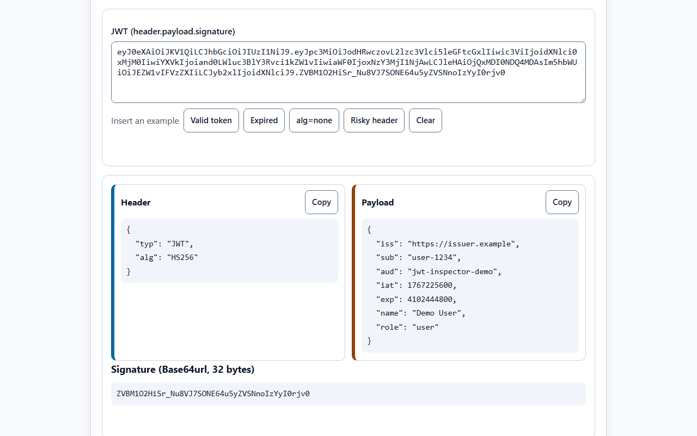
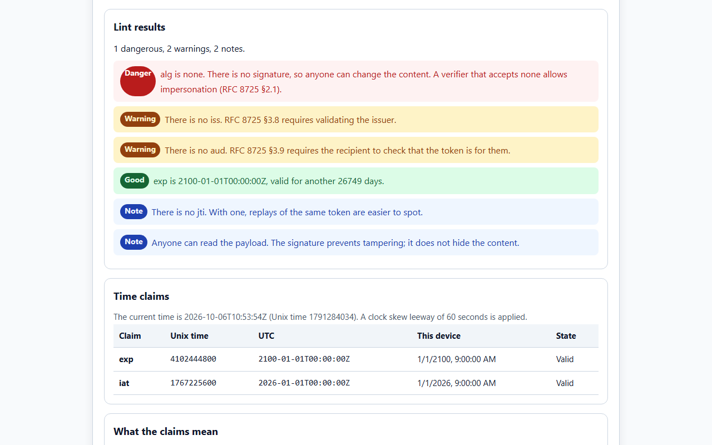
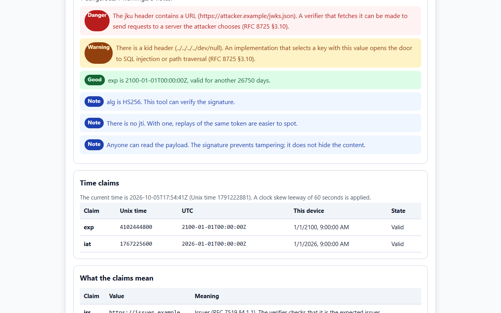
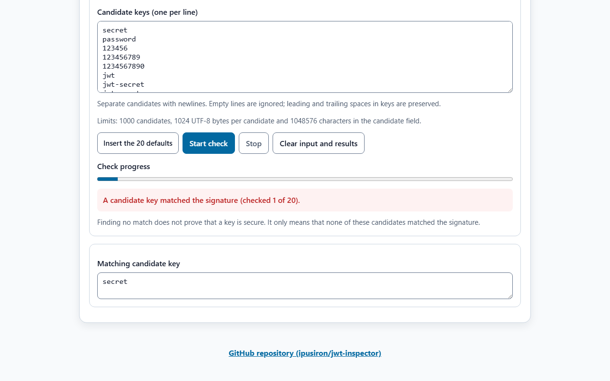
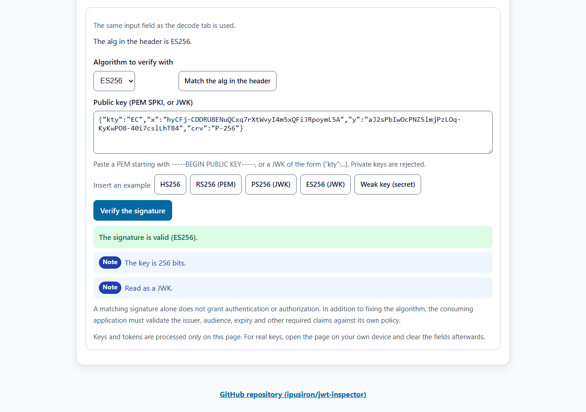
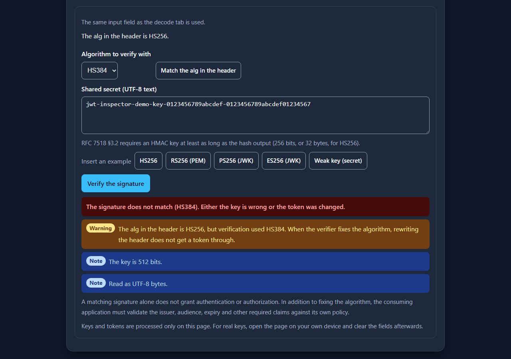
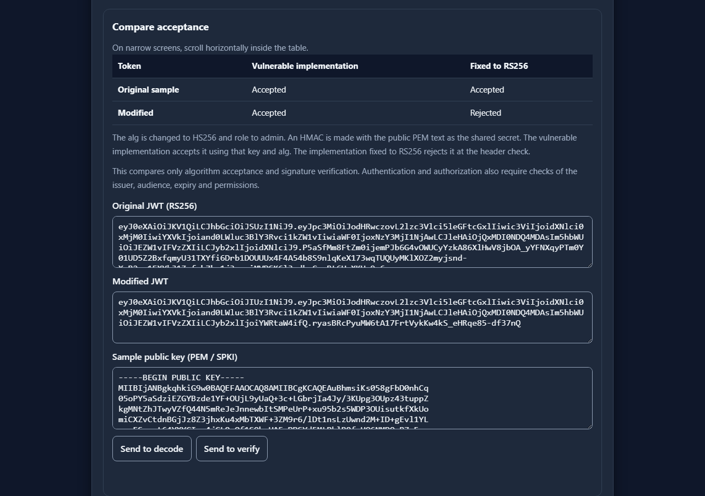

English · [日本語](README.md)

# JWT Inspector - JWT Decoder, Linter and Signature Verifier


[](https://ipusiron.github.io/jwt-inspector/)

**Day053 - 100 Security Tools with Generative AI**

JWT Inspector decodes a JWT entirely in the browser, lints it against RFC 7519 and RFC 8725, and verifies its signature. Each lint result carries the RFC section it comes from, so the reason is one step away. Neither the token nor the key is ever sent anywhere.

---

## 🌐 Demo

👉 **[https://ipusiron.github.io/jwt-inspector/](https://ipusiron.github.io/jwt-inspector/)**

You can try it directly in your browser.

---

## 📸 Screenshots

>
>
>*The header and payload decoded, with the size of the signature*

>
>
>*alg=none is flagged as dangerous, with the reason and the RFC section*

>
>
>*jku and kid can open the door to SSRF or injection, depending on the verifier*

>
>
>*The time claims in Unix time, UTC and the time of this device*

>
>
>*An ES256 signature verified with a JWK public key, with the key size and how it was read*

>
>
>*A header of HS256 does not get through when HS384 is used, which is what fixing the algorithm buys you*

>
>
>*Where implementations go wrong, with the RFC sections they come from*

---

## 🔑 What this tool looks at

A JWT is signed, not encrypted. Anyone can read the payload by undoing Base64url. And a small shortcut in the verifier turns straight into impersonation. RFC 8725 is the BCP that collects the attacks that actually happened and what to do about them.

From a single token, this tool checks:

- what the alg in the header is, and whether it is none or a case variant of it
- whether headers that point at a key (jku, x5u, jwk, kid) are present
- how the time claims (exp, nbf, iat) stand against the current time
- whether the issuer and the audience (iss, aud) are present and of the right type
- whether the payload carries claims whose names look like secrets
- whether the signature verifies with the key you have, and whether that key meets the length the RFCs require

---

## ✨ Features

### Decode and lint

- Decodes Base64url one character at a time, reporting = padding, mixed-in + and /, and lengths that cannot work, each with its position
- Checks that the header and the payload are JSON objects, and reports repeated member names (RFC 7515 §4)
- Groups the lint results into danger, warning, note and good, each with the RFC section it comes from
- Shows the time claims in a table of Unix time, UTC, the time of this device and the verdict, with a clock skew leeway of 60 seconds
- Lists the meaning of the registered claims (iss, sub, aud, exp, nbf, iat, jti)
- Four samples (valid, expired, alg=none, risky header)

### Verify the signature

- Twelve algorithms: HS256, HS384, HS512, RS256, RS384, RS512, PS256, PS384, PS512, ES256, ES384, ES512
- The algorithm used for verification is chosen on the page, not taken from the header (RFC 8725 §3.1). A mismatch is reported
- Keys are a shared secret for HS, and a PEM (SPKI) or a JWK otherwise. Private keys, PKCS#1, certificates and JWK Sets are rejected with the reason
- Key lengths are checked against RFC 7518 (HMAC at least as long as the hash output, RSA at least 2048 bits)
- Five samples (HS256, RS256 as PEM, PS256 as JWK, ES256 as JWK, weak key)

### Learn

- The structure, the fact that the payload is readable, alg=none and fixing the algorithm, key strength, headers that point at keys, and checking times and recipients, each with its RFC section

### Common

- Japanese and English (`?lang=ja`, `?lang=en`; the chosen language is saved)
- Light and dark themes (follows the OS setting unless a choice has been saved)
- Keyboard operation (tabs move with the arrow keys, Home and End)

---

## 📖 How to use

1. Paste a JWT into the "Decode and lint" tab. The sample buttons also work.
2. Read the lint results from the top. Each danger and warning says which RFC section it is measured against.
3. To check the signature, go to the "Verify" tab, choose the algorithm and paste the key. The token comes from the same field as the decode tab.
4. "Match the alg in the header" switches to the header's algorithm. Choose a different one on purpose to see that it does not verify.

---

## 🔬 Technical notes

### The structure of a JWT

The JWS Compact Serialization (RFC 7515 §7.1) is the header, the payload and the signature, each in Base64url and joined with dots. Base64url here omits the trailing = (§2). The signature covers the whole string "header.payload", so changing one character makes it no longer match.

### What is linted

| Item | Verdict | Basis |
|---|---|---|
| alg=none | Danger | RFC 8725 §2.1. Without a signature, anyone can change the content |
| alg as None, NONE and so on | Danger | RFC 7515 §4.1.1 defines alg as case-sensitive; an implementation that ignores case reads it as none |
| jku, x5u | Danger | RFC 8725 §3.10. A verifier that fetches them can be sent to a server of the attacker's choosing |
| jwk | Danger | The token carries its own public key; verifying with it lets anyone sign |
| kid | Warning | RFC 8725 §3.10. Used as-is for key lookup, it opens the door to injection |
| crit | Warning | RFC 7515 §4.1.11. A token must be rejected when the listed extensions are not understood |
| Repeated member names | Danger | RFC 7515 §4. Implementations may read different ones |
| exp at or before now | Danger | RFC 7519 §4.1.4. The same second as exp also counts as expired |
| nbf in the future | Danger | RFC 7519 §4.1.5 |
| iat in the future | Warning | RFC 7519 §4.1.6 |
| iss or aud missing | Warning | RFC 8725 §3.8 and §3.9 |
| typ missing | Note | RFC 8725 §3.11 recommends stating the type |
| Claims whose names look like secrets | Danger | The payload is only signed, not encrypted |

### Supported algorithms

| Family | Names | Web Crypto name | Key |
|---|---|---|---|
| HS | HS256, HS384, HS512 | HMAC | Shared secret (UTF-8 text) |
| RS | RS256, RS384, RS512 | RSASSA-PKCS1-v1_5 | Public key (PEM SPKI or JWK) |
| PS | PS256, PS384, PS512 | RSA-PSS | Public key (same) |
| ES | ES256, ES384, ES512 | ECDSA (P-256, P-384, P-521) | Public key (same) |

The PS salt length equals the hash output (RFC 7518 §3.5). The ES curve follows from the algorithm (§3.4).

### Key length

RFC 7518 §3.2 requires an HMAC key at least as long as the hash output (256 bits for HS256). RSA keys must be 2048 bits or more (§3.3 and §3.5). RFC 8725 §3.5 states that a human-memorable password must not be used directly as an HS256 key, because a token signed with a short key gives the key away to anyone who runs a dictionary locally.

This tool flags a short key as dangerous even when the signature verifies.

### Fixing the algorithm

RFC 8725 §3.1 requires the caller to specify the supported algorithms and the library to use no others. An implementation that follows the alg in the header accepts both of these:

- a token whose alg was rewritten to none
- a token whose RS256 was rewritten to HS256 and re-signed using the public key as the HMAC shared secret (CVE-2015-9235)

This tool uses only the algorithm chosen on the page and reports a mismatch with the header. The second case is also covered by the tests (`test/verify.test.js`), which build a token signed with the public key as an HS256 key.

---

## 🎯 Use cases

- Checking your own service: paste a token you issue and check the lifetime of exp, the presence of iss and aud, and the key length
- Reviewing an implementation: show alg=none and algorithm pinning on a working page when discussing them with your team
- CTFs and exercises: look straight into a token you were given, including a kid or jku planted in the header
- Teaching: let people read the payload to see that a JWT is not encrypted and what the signature actually protects
- Design decisions: compare HS, RS, PS and ES side by side, including how the keys have to be distributed
- Debugging: when authentication fails, separate an expired token from a wrong key or a wrong algorithm
- Writing documents: attach the lint screen to an internal guideline or a review checklist
- Classes and training: practice reading Base64url, the difference between signing and encrypting, and how times are handled

---

## 🔒 Security

- Content Security Policy (meta tag): `default-src 'self'; script-src 'self'; style-src 'self'; img-src 'self' data:; connect-src 'none'; object-src 'none'; base-uri 'none'; form-action 'none'`. No inline scripts or styles, and no external communication
- Tokens and keys are processed only in the browser, never sent anywhere and never stored
- The token and key fields turn off spell checking and autocorrect, so that a pasted key is not sent to an external spell checker
- The page is built with the DOM (`textContent`), never `innerHTML`
- `<meta name="referrer" content="no-referrer">`; external links use `rel="noopener noreferrer"`
- Only the language and theme choices are stored in the browser
- Signatures are verified with Web Crypto, without external libraries

---

## ⚠️ Notes and limitations

- The sample keys were made for this tool's demos. They are not production keys
- When handling real keys or tokens, open the page on your own device and clear the fields afterwards
- EdDSA and JWE (encrypted JWTs) are not supported
- JWK Sets are not read, and keys are not fetched from a jku URL (the tool makes no external requests)
- Linting is limited to what a single token shows. Whether the issuer is really right, and whether the audience is you, is for the verifying application to decide
- Tokens are read up to 16384 characters

---

## 🧪 Tests

```bash
npm test
```

- Runs with `node --test` on Node.js 22 or later, with no dependencies (no `npm install` needed)
- Runs on GitHub Actions for every push and pull request
- `test/core.test.js`: Base64url round trips and errors, detection of repeated member names, token parsing, time verdicts, every lint item
- `test/verify.test.js`: verification of the twelve algorithms (PEM and JWK), a single flipped bit in the signature, a rewritten payload, the public-key-as-HMAC-key swap, key lengths, malformed keys
- `test/html.test.js`, `test/contrast.test.js`, `test/messages.test.js`, `test/i18n.test.js`, `test/format.test.js`: CSP, tab ARIA, dictionary and page text, color contrast (4.5:1 and 3:1), formatting
- `test/readme.test.js`: checks the README tables (lint items, algorithms) against the core module, and the headings, images and directory structure of both READMEs
- The samples and test vectors were produced with Node.js `crypto` using real keys. No private key is kept in this repository

---

## 🔗 References

- [RFC 7515 JSON Web Signature (JWS)](https://www.rfc-editor.org/rfc/rfc7515)
- [RFC 7517 JSON Web Key (JWK)](https://www.rfc-editor.org/rfc/rfc7517)
- [RFC 7518 JSON Web Algorithms (JWA)](https://www.rfc-editor.org/rfc/rfc7518)
- [RFC 7519 JSON Web Token (JWT)](https://www.rfc-editor.org/rfc/rfc7519)
- [RFC 8725 JSON Web Token Best Current Practices](https://www.rfc-editor.org/rfc/rfc8725)
- [CVE-2015-9235](https://nvd.nist.gov/vuln/detail/CVE-2015-9235)

---

## 📁 Directory structure

```
jwt-inspector/
├── index.html                # The page (three tabs)
├── script.js                 # Page logic (building the DOM, events)
├── style.css                 # Color tokens (light and dark) and layout
├── js/                       # Scripts shared by the page and the tests
│   ├── jwt-core.js           # Base64url, JSON, token parsing, times, linting (no DOM)
│   ├── jwt-verify.js         # Signature verification (Web Crypto), PEM and JWK, key lengths
│   ├── jwt-create.js         # In-memory key generation and JWT signing
│   ├── jwt-lab.js            # Small HS256 dictionary checks and built-in sample demonstrations
│   ├── workbench-ui.js       # Creation, dictionary and demonstration UI with asynchronous state
│   ├── samples.js            # Sample tokens and keys (public keys and a demo secret only)
│   ├── messages.js           # Japanese and English text
│   ├── i18n.js               # Language selection and static text replacement
│   ├── theme-init.js         # Applies the saved theme before rendering
│   └── theme.js              # Light and dark switching
├── test/                     # Tests with node:test
│   ├── load.js               # Helper that loads js/*.js into the tests
│   ├── fixtures.json         # Test vectors (tokens and keys for twelve algorithms)
│   ├── core.test.js          # Decoding, linting, times
│   ├── verify.test.js        # Signature verification and key formats
│   ├── create.test.js        # Key generation, signing and input limits
│   ├── lab.test.js           # Dictionary checks, cancellation and algorithm confusion
│   ├── ui-state.test.js      # Input changes, language switching and discarding stale asynchronous results
│   ├── readme.test.js        # README tables, headings, images, structure
│   ├── html.test.js          # CSP, ARIA, text, ids
│   ├── contrast.test.js      # Color contrast, 44px and 16px
│   ├── messages.test.js      # Dictionary keys, notation, numbers
│   ├── i18n.test.js          # How the language is chosen
│   └── format.test.js        # Line length, line endings, final newline
├── assets/                   # README screenshots
│   ├── screenshot.png        # Decode (Japanese)
│   ├── screenshot2.png       # alg=none lint (Japanese)
│   ├── screenshot3.png       # Headers that point at keys (Japanese)
│   ├── screenshot4.png       # Time table (Japanese)
│   ├── screenshot5.png       # ES256 verification (Japanese)
│   ├── screenshot6.png       # Algorithm mismatch (Japanese, dark)
│   ├── screenshot7.png       # Learn tab (Japanese, dark)
│   └── en/                   # Screenshots of the English page (the same seven)
├── .github/                  # GitHub settings
│   └── workflows/            # GitHub Actions workflows
│       └── test.yml          # Runs npm test on push and pull request
├── package.json              # Defines npm test (no dependencies)
├── .gitignore                # Files kept out of Git
├── .nojekyll                 # Disables Jekyll on GitHub Pages
├── CLAUDE.md                 # Development notes for Claude Code
├── FUTURE_IDEAS.md           # Future enhancement ideas
├── LICENSE                   # MIT License
├── README.md                 # Japanese README
└── README.en.md              # This file
```

---

## 💻 Requirements

- A recent browser (checked on Chromium, Edge and Firefox; Safari not checked)
- Signature verification uses Web Crypto

```bash
python -m http.server 8000
# open http://localhost:8000/
```

---

## 📄 License

- See the `LICENSE` file (MIT) for the source code license.
- No external libraries are used. Signatures are verified with the browser's Web Crypto.

---

## 🛠️ About this tool

This tool was developed as part of the "100 Security Tools with Generative AI" project.
The project builds and publishes a variety of security-related tools over 100 days with the help of AI.

For details about the project and other tools, see the page below.

🔗 [https://akademeia.info/?page_id=42163](https://akademeia.info/?page_id=42163)
