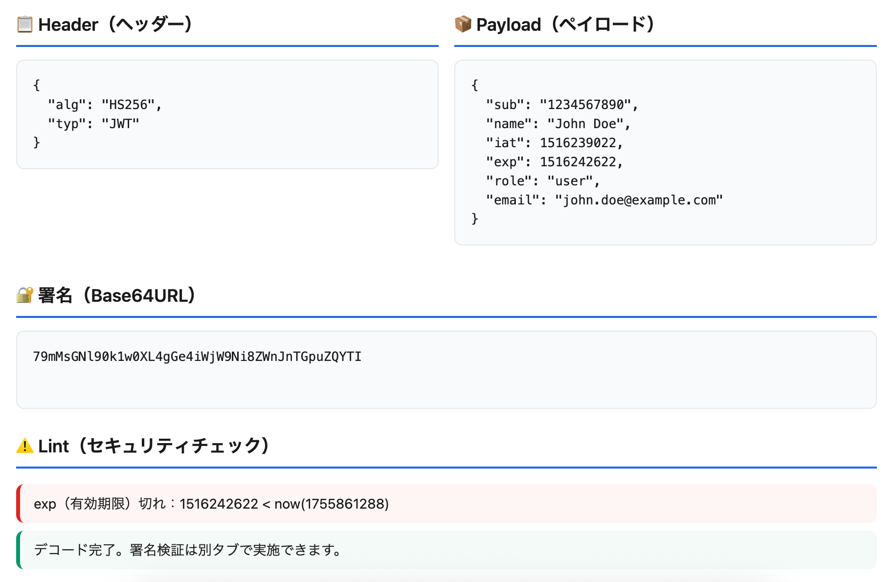

<!--
---
id: day053
slug: jwt-inspector

title: "JWT Inspector"

subtitle_ja: "JWT（JSON Web Token）可視化・検証ツール"
subtitle_en: "JWT Decoder, Verifier & Security Linter"

description_ja: "ブラウザー上でJWTをデコード・検証し、alg=none攻撃や期限切れなどのセキュリティリスクを自動検出するツール"
description_en: "Decode and verify JWTs (HS256/RS256) in-browser, with security lint hints for alg=none attacks, expiration issues, and more"

category_ja:
  - Webセキュリティ
  - 認可
category_en:
  - Web Security
  - Authorization

difficulty: 3

tags:
  - jwt
  - websecurity
  - crypto
  - education
  - authentication
  - web-crypto-api

repo_url: "https://github.com/ipusiron/jwt-inspector"
demo_url: "https://ipusiron.github.io/jwt-inspector/"

hub: true
---
-->

# JWT Inspector - JWT（JSON Web Token）可視化・検証ツール


[](https://ipusiron.github.io/jwt-inspector/)

**Day053 - 生成AIで作るセキュリティツール100**

**JWT Inspector**は、ブラウザー上でJWTを**デコード／検証**し、典型的なリスク（`alg=none`、弱いHS鍵、期限切れなど）を**Lint表示**する軽量ツールです。

外部にトークンを送信しないため、学習・検証用途に安全に利用できます。

---

## 🌐 デモページ

👉 **[https://ipusiron.github.io/jwt-inspector/](https://ipusiron.github.io/jwt-inspector/)**

ブラウザーで直接お試しいただけます。

---

## 📸 スクリーンショット

>   
>
> *JWTトークンのデコードチェック*

---

## ✨ 特長

### 主要機能
- **🔓 デコード機能**
  - Base64URLデコードしてHeader/Payloadを整形表示
  - 署名部分の表示
  - 3種類のサンプルJWT（正常、期限切れ、alg=none）をワンクリック入力
  
- **✅ 署名検証機能**
  - HS256（HMAC-SHA-256）による共有鍵検証
  - RS256（RSA + SHA-256）による公開鍵検証
  - クイック検証: 事前設定済みのサンプルで即座に検証体験
  - 手動検証: 独自のJWTと鍵で詳細な検証
  
- **⚠️ セキュリティLint機能**
  - `alg=none`攻撃の検出と警告
  - 有効期限（`exp`）切れの検出
  - 有効開始前（`nbf`）の検出
  - 発行時刻（`iat`）の将来日付警告
  - `kid`ヘッダーのセキュリティリスク警告
  - 検証結果を色分けで視覚的に表示
  
- **📚 学習機能**
  - JWTの基礎知識と用語解説
  - セキュリティリスクの具体例
  - 攻撃シナリオの詳細説明
  - CTFや実務での活用方法

### UI/UX特徴
- **レスポンシブデザイン**: モバイル・タブレット完全対応
- **ライトモードUI**: 見やすく目に優しいデザイン
- **タブインターフェース**: 機能ごとに整理された画面構成
- **ワンクリック操作**: サンプル入力ボタンで即座に機能確認
- **エラーメッセージ**: 分かりやすい日本語での詳細なエラー表示

---

## 🚀 使い方

### デコードタブ
1. **JWTトークンを入力**
   - 手動でJWTを貼り付け、または
   - サンプルボタン（正常JWT、期限切れJWT、alg=none JWT）を選択
2. **「🔍 デコード実行」ボタンをクリック**
3. **結果確認**
   - Header（ヘッダー）: アルゴリズムやタイプ情報
   - Payload（ペイロード）: トークンに含まれるデータ
   - 署名: Base64URL形式の署名データ
   - Lint結果: セキュリティ上の問題点を自動検出

### 検証タブ
1. **クイック検証（初心者向け）**
   - 「🔑 HS256サンプル検証」または「🏢 RS256サンプル検証」をクリック
   - 自動的にサンプルJWTと鍵が入力され、検証結果を表示
   
2. **手動検証（上級者向け）**
   - デコードタブでJWTを入力済みであることを確認
   - アルゴリズム（HS256/RS256）を選択
   - 対応する鍵を入力
   - 「🔒 署名検証実行」ボタンをクリック

### 学習タブ
- JWTのセキュリティリスクと対策を学習
- 実際の攻撃シナリオを理解
- ベストプラクティスを確認

---

## ⚠️ セキュリティ注意

- 貼り付けたトークンや鍵は**ブラウザー内だけ**で処理します（送信なし）。
- 学習目的での使用を想定。実運用の鍵・トークンを取り扱う場合は十分に注意してください。

---

## 🔐 JWT（JSON Web Token）とは

JWTは、ユーザー認証やセキュアなデータ交換のための**言語非依存の標準フォーマット**です。

### どういったものか？
- `header.payload.signature`の3つの部分をドット（.）で繋げた文字列
- Base64URLエンコードされており、改ざん検知のための署名機能を持つ
- JSON形式でデータを格納し、コンパクトで自己完結型のトークン

### 何に役立つのか？
- **認証**: ユーザーがログインしているかの確認
- **認可**: ユーザーの権限（アクセス権）の管理
- **情報交換**: 当事者間でのセキュアなデータ交換
- **セッション管理**: サーバーレスでのユーザー状態管理

### どこで使われるのか？
- **Web API**: REST APIの認証トークンとして
- **シングルサインオン（SSO）**: 複数サービス間での認証連携
- **モバイルアプリ**: スマートフォンアプリの認証
- **マイクロサービス**: サービス間通信での認証・認可
- **OAuth 2.0 / OpenID Connect**: 標準認証プロトコルでの実装

### 技術的特徴
- ステートレス（サーバー側でセッション情報を保持不要）
- 拡張性が高く、カスタムクレーム（データ）を追加可能

---

## 🛡️ JWTとセキュリティの関連性

JWTは認証・認可の核となる技術であり、**セキュリティの要**です。しかし、不適切な実装や設定により深刻な脆弱性を生む可能性があります。

### なぜJWTのセキュリティが重要か？
- **機密情報の漏洩**: 不正なトークンでユーザーデータにアクセス
- **権限昇格**: 一般ユーザーが管理者権限を取得
- **なりすまし**: 他のユーザーとしてシステムにアクセス
- **セッションハイジャック**: 正当なユーザーのセッションを乗っ取り

---

## 🚨 JWTの悪用例と攻撃シナリオ

### シナリオ1: alg=none攻撃による権限昇格
```
攻撃者の行動：
1. 正当なJWTを取得: eyJhbGciOiJIUzI1NiJ9.eyJ1c2VyIjoiam9obiIsInJvbGUiOiJ1c2VyIn0.signature
2. Headerのalgをnoneに変更、roleをadminに変更
3. 署名部分を削除してトークンを送信
4. サーバーがalg=noneを許可していた場合→管理者権限で侵入成功

被害：
- 管理者機能への不正アクセス
- 他のユーザーデータの閲覧・改ざん
- システム全体への影響
```

### シナリオ2: 弱いHS256鍵への辞書攻撃
```
攻撃者の行動：
1. 公開されているJWTを収集
2. 一般的なパスワード辞書を使用してHS256の共有鍵を総当たり
3. 「secret」「password」「123456」等の弱い鍵が見つかる
4. 偽造したJWTで任意のユーザーになりすまし

被害：
- 全ユーザーアカウントへの不正アクセス
- 機密データの大量流出
- 金融取引等の不正操作
```

---

## 💡 本ツールの活用場面
このツールは、こうした脆弱性を**事前に検出**し、開発者が安全なJWT実装を行うための支援を目的としています。

### 🏆 CTF（Capture The Flag）での活用

**Webセキュリティ問題の解析**
- JWT関連のCTF問題で素早くトークンを解析
- `alg=none`や弱い鍵の脆弱性を即座に発見
- ペイロード内のフラグやヒントを効率的に抽出
- 署名検証でHS256の弱い鍵を特定

**具体的なCTFシナリオ**
- ログイン後に受け取ったJWTの`role`クレームを確認
- 有効期限切れのトークンから情報を抽出
- kidヘッダーからサーバーの鍵管理の脆弱性を推測
- 複数のJWTを比較して暗号化アルゴリズムの傾向を分析

### 💼 実務・開発現場での活用

**開発・テスト段階**
- 自社APIが発行するJWTの品質チェック
- QAテスト時のトークン検証とデバッグ
- CI/CDパイプラインでのセキュリティ自動チェック
- 新機能リリース前のJWT設定検証

**セキュリティ監査・ペネトレーションテスト**
- クライアントシステムのJWT実装診断
- 第三者認証サービス（Auth0、Firebase等）の設定確認
- マイクロサービス間通信のセキュリティ検証
- OAuth/OpenID Connectの実装品質チェック

**インシデント対応・フォレンジック**
- 不正アクセス時のJWTログ解析
- 攻撃者が使用したトークンの詳細調査
- 漏洩したトークンの影響範囲特定
- セキュリティインシデントの原因究明

**教育・トレーニング**
- 新人エンジニアへのJWTセキュリティ教育
- セキュリティ研修での実践的なハンズオン
- 大学・専門学校でのWebセキュリティ講義
- 社内セキュリティ意識向上のデモンストレーション

### 日常的な開発サポート
- **API開発**: 発行したJWTが正しい形式かの確認
- **フロントエンド開発**: 受け取ったトークンの中身確認
- **デバッグ**: 認証エラーの原因特定
- **ドキュメント作成**: JWTの仕様書作成時の検証

---

## 📚　用語解説

### デコード
- Base64URLエンコードされたJWTを人間が読める形式に変換すること
- HeaderとPayload部分のJSON内容を表示する処理

### 署名検証
- JWT作成時に付与された署名が正当であるかを確認する処理
- **HS256**: 共有秘密鍵を使用した署名方式（HMAC-SHA-256）
- **RS256**: 公開鍵・秘密鍵ペアを使用した署名方式（RSA + SHA-256）

### Lint（リント）
- コードやデータの潜在的な問題を自動検出・警告する機能
- このツールでは以下のようなセキュリティ問題を検出：
  - `alg=none`: 署名なしトークン（危険）
  - `exp`: 有効期限切れの検出
  - `nbf`: 有効開始前の検出
  - `iat`: 発行時刻が未来に設定されている場合の警告

### 主要なJWTクレーム
- **exp** (expiration): 有効期限（UNIX時間）
- **nbf** (not before): 有効開始時刻（UNIX時間）
- **iat** (issued at): 発行時刻（UNIX時間）
- **kid** (key ID): 署名に使用する鍵の識別子
- **alg** (algorithm): 署名アルゴリズムの種類

---

## 🔧 技術仕様

### 実装技術
- **フロントエンド**: 純粋なHTML5/CSS3/JavaScript（ES6+）
- **依存関係**: なし（ゼロ依存）
- **暗号化API**: Web Crypto API (SubtleCrypto)
  - HS256: HMAC-SHA-256
  - RS256: RSA-PKCS1-v1_5 + SHA-256（RSA-PSSではない）
- **エンコーディング**: Base64URL形式のカスタム実装

### ブラウザー要件
- **推奨**: Chrome 90+, Firefox 88+, Safari 14+, Edge 90+
- **必須機能**: Web Crypto API対応
- **モバイル**: iOS Safari 14+, Chrome for Android 90+

### セキュリティ設計
- **完全クライアントサイド処理**: サーバー通信なし
- **データ保持なし**: localStorage/sessionStorage不使用
- **外部リクエストなし**: 完全オフライン動作可能

---

## 📁 ディレクトリー構成

```
jwt-inspector/
├── index.html          # メインHTML（UIレイアウト、タブ構造）
├── script.js           # JavaScriptロジック（JWT処理、検証、UI制御）
├── style.css           # スタイルシート（レスポンシブデザイン対応）
├── README.md           # プロジェクト説明とドキュメント
├── CLAUDE.md           # Claude Code用の開発ガイドライン
├── LICENSE             # MITライセンス
├── .gitignore          # Git除外設定
├── .nojekyll           # GitHub Pages用設定
└── assets/             # 画像・リソース
    └── screenshot.png  # スクリーンショット
```

### ファイル詳細

- **`index.html`** (7.5KB)
  - 3つのタブ（デコード、検証、学習）のUI構造
  - サンプル入力ボタンとフォーム要素
  - モバイル対応のviewport設定
  
- **`script.js`** (12.2KB)
  - JWT解析・検証のコアロジック
  - Web Crypto APIを使用した署名検証
  - セキュリティLint機能の実装
  - UIイベントハンドリング
  
- **`style.css`** (11.6KB)
  - ライトモードベースのモダンUI
  - レスポンシブデザイン（768px ブレークポイント）
  - CSS変数による統一的なテーマ管理
  - タブ、カード、ボタンのカスタムスタイル

---

## 📄 ライセンス

MIT License - 詳細は [LICENSE](LICENSE) をご覧ください。

---

## 🛠 このツールについて

本ツールは、「生成AIで作るセキュリティツール100」プロジェクトの一環として開発されました。  
このプロジェクトでは、AIの支援を活用しながら、セキュリティに関連するさまざまなツールを100日間にわたり制作・公開していく取り組みを行っています。

プロジェクトの詳細や他のツールについては、以下のページをご覧ください。  

🔗 [https://akademeia.info/?page_id=42163](https://akademeia.info/?page_id=42163)