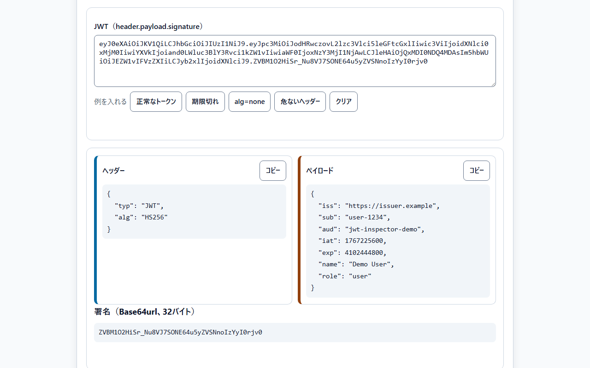
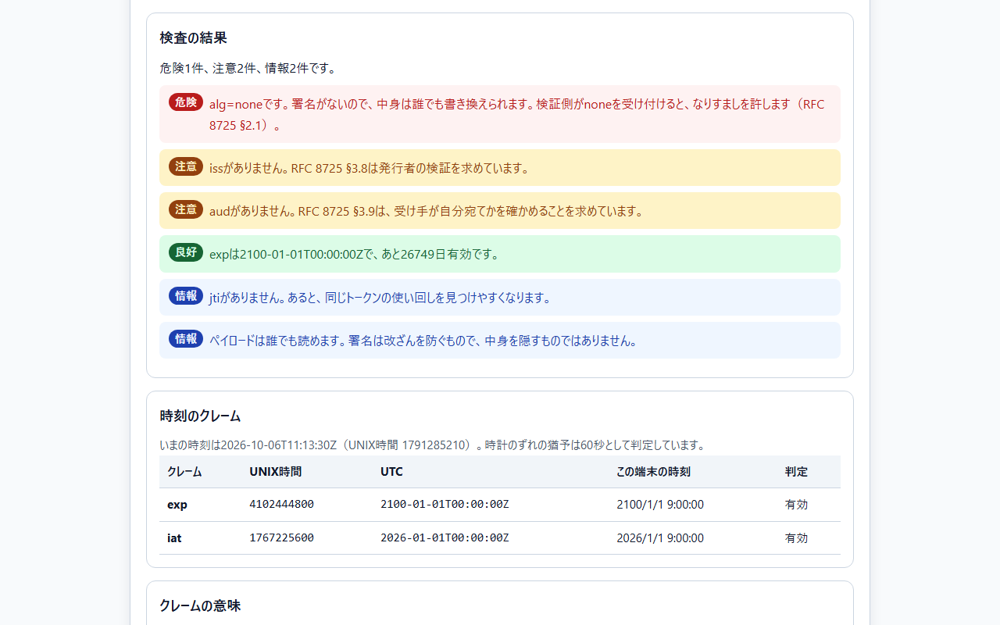
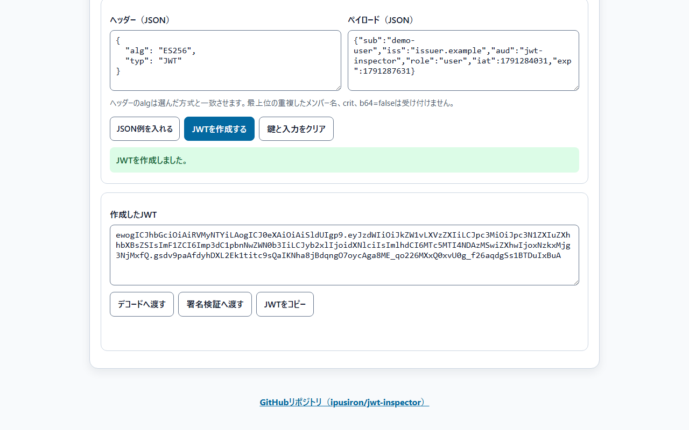
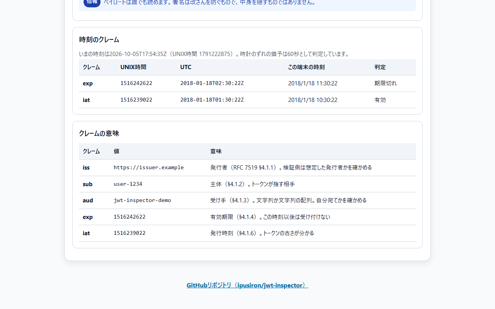
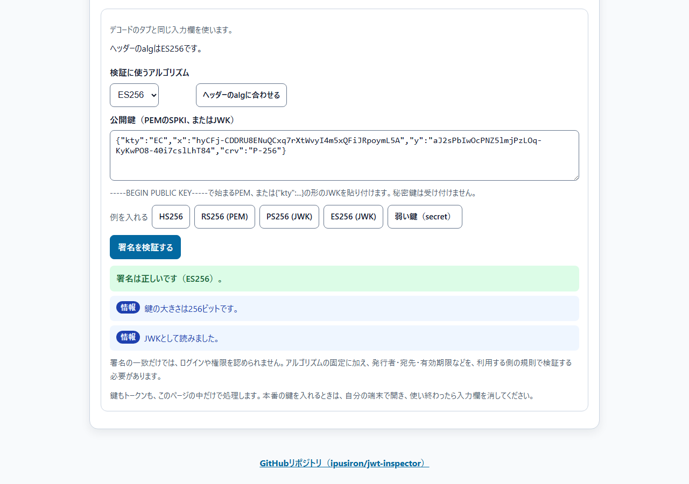
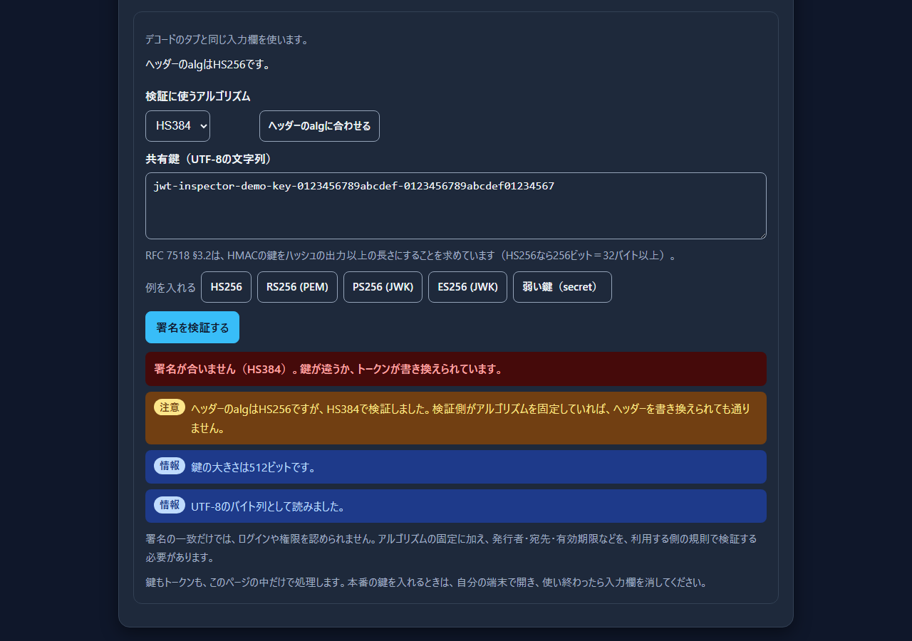
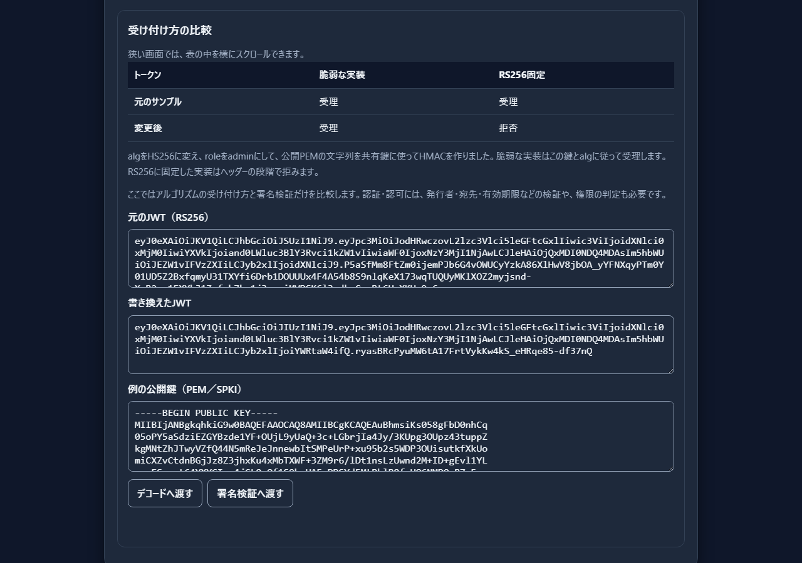

<!--
---
id: day053
slug: jwt-inspector

title: "JWT Inspector"

subtitle_ja: "JWTのデコード・検査・署名検証ツール"
subtitle_en: "JWT Decoder, Linter and Signature Verifier"

description_ja: "JWTをブラウザーの中だけでデコードし、RFC 7519・RFC 8725に沿って検査して、HS・RS・PS・ESの256〜512の署名を検証する学習ツール。alg=none、鍵を指すヘッダー、期限切れ、弱い鍵などを指摘する。"
description_en: "A learning tool that decodes JWTs entirely in the browser, lints them against RFC 7519 and RFC 8725, and verifies HS, RS, PS and ES signatures from 256 to 512. It flags alg=none, headers that point at keys, expiry problems and weak keys."

category_ja:
  - Webセキュリティ
  - 認可
category_en:
  - Web Security
  - Authorization

difficulty: 3

tags:
  - jwt
  - jws
  - websecurity
  - crypto
  - education
  - authentication
  - web-crypto-api
  - rfc8725

repo_url: "https://github.com/ipusiron/jwt-inspector"
demo_url: "https://ipusiron.github.io/jwt-inspector/"

hub: true
---
-->

# JWT Inspector - JWTのデコード・検査・署名検証ツール

[English](README.en.md) · 日本語


[](https://ipusiron.github.io/jwt-inspector/)

**Day053 - 生成AIで作るセキュリティツール100**

JWT Inspectorは、JWTをブラウザーの中だけでデコードし、RFC 7519とRFC 8725に沿って検査して、署名を検証するツールです。検査の結果にはRFCの節を添えてあり、なぜ問題なのかをその場でたどれます。トークンも鍵も、どこにも送りません。

---

## 🌐 デモページ

👉 **[https://ipusiron.github.io/jwt-inspector/](https://ipusiron.github.io/jwt-inspector/)**

ブラウザーで直接お試しいただけます。

---

## 📸 スクリーンショット

>
>
>*ヘッダーとペイロードをデコードし、署名のバイト数を示す*

>
>
>*alg=noneは危険として、理由とRFCの節を示す*

>
>
>*jkuとkidは、検証側の実装によってはSSRFやインジェクションの入口になる*

>
>
>*時刻のクレームを、UNIX時間・UTC・この端末の時刻で並べる*

>
>
>*ES256の署名をJWKの公開鍵で検証し、鍵の大きさと読み取り方を示す*

>
>
>*ヘッダーがHS256でもHS384で検証すれば通らない。検証側がアルゴリズムを固定する意味が分かる*

>
>
>*実装でつまずきやすい点を、RFCの節を添えてまとめる*

---

## 🔑 このツールが見るもの

JWTは署名されていますが、暗号化されていません。ペイロードはBase64urlを戻すだけで誰でも読めます。そして、検証側の実装のわずかな手抜きが、そのままなりすましにつながります。RFC 8725は、実際に起きた攻撃と、その対策をまとめたBCPです。

このツールは、トークン1つを手がかりに次を調べます。

- ヘッダーのalgが何で、noneや大文字小文字を変えた書き方になっていないか
- 鍵の場所を指すヘッダー（jku・x5u・jwk・kid）が入っていないか
- 時刻のクレーム（exp・nbf・iat）が、いまの時刻に照らしてどうなっているか
- 発行者と受け手（iss・aud）が入っているか、型は正しいか
- ペイロードに、秘密らしい名前のクレームが入っていないか
- 署名が、自分の持っている鍵で検証できるか。その鍵はRFCが求める長さを満たしているか

---

## ✨ 機能

### デコードと検査

- Base64urlを1文字ずつ検査してデコードする。=が付いている、+と/が混ざっている、文字数が合わないといった誤りを、位置を添えて示す
- ヘッダーとペイロードがJSONオブジェクトであることを確かめ、同じ名前のメンバーが複数あれば指摘する（RFC 7515 §4）
- 検査の結果を危険・注意・情報・良好に分け、RFCの節を添えて並べる
- 時刻のクレームを、UNIX時間・UTC・この端末の時刻・判定の表で示す。時計のずれの猶予は60秒
- 登録済みクレーム（iss・sub・aud・exp・nbf・iat・jti）の意味を並べる
- サンプル4つ（正常・期限切れ・alg=none・危ないヘッダー）

### 署名検証

- HS256・HS384・HS512、RS256・RS384・RS512、PS256・PS384・PS512、ES256・ES384・ES512の12種類
- 検証に使うアルゴリズムは、ヘッダーのalgではなく画面で選ぶ（RFC 8725 §3.1）。食い違えば、その旨を示す
- 鍵は、HSが共有鍵の文字列、それ以外はPEM（SPKI）かJWK。秘密鍵・PKCS#1・証明書・JWK Setは、理由を添えて断る
- 鍵の長さをRFC 7518に照らす（HMACはハッシュの出力以上、RSAは2048ビット以上）
- サンプル5つ（HS256・RS256はPEM・PS256はJWK・ES256はJWK・弱い鍵）

### 学習

- 構造、ペイロードが読めること、alg=noneとアルゴリズムの固定、鍵の強さ、鍵を指すヘッダー、時刻と相手の検証を、RFCの節を添えてまとめる

### 共通

- 日本語と英語の切り替え（`?lang=ja`・`?lang=en`、選んだ言語を保存）
- ライト・ダークの切り替え（保存した選択がなければOSの設定に従う）
- キーボード操作（タブは矢印キー・Home・Endで移動）

---

## 📖 使い方

1. 「デコードと検査」タブにJWTを貼り付けます。サンプルのボタンでも試せます。
2. 検査の結果を上から読みます。危険・注意には、RFCのどの節に照らした指摘かが書いてあります。
3. 署名を確かめるときは「署名検証」タブへ移り、アルゴリズムを選んで鍵を貼り付けます。トークンはデコードのタブと同じ欄を使います。
4. 「ヘッダーのalgに合わせる」を押すと、ヘッダーのalgに切り替わります。わざと違うものを選んで、通らないことを確かめられます。

---

## 🔬 技術的な説明

### JWTの構造

JWS Compact Serialization（RFC 7515 §7.1）は、ヘッダー・ペイロード・署名をそれぞれBase64urlにして、ドットでつないだ形です。Base64urlは末尾の=を付けません（§2）。署名は「ヘッダー.ペイロード」の文字列全体にかかるため、1文字でも変えると署名は合いません。

### 検査の項目

| 項目 | 判定 | 根拠 |
|---|---|---|
| alg=none | 危険 | RFC 8725 §2.1。署名がないので中身を誰でも書き換えられる |
| algがNone・NONEなど | 危険 | RFC 7515 §4.1.1はalgを大文字と小文字を区別する文字列と定める。区別せず比べる実装ではnoneになる |
| jku・x5u | 危険 | RFC 8725 §3.10。検証側が取りに行くと、攻撃者の指すサーバーへ要求を送らされる |
| jwk | 危険 | トークン自身が公開鍵を運ぶ。この鍵で検証すると誰でも署名を作れる |
| kid | 注意 | RFC 8725 §3.10。鍵の選択にそのまま使うとインジェクションの入口になる |
| crit | 注意 | RFC 7515 §4.1.11。理解できない拡張が挙がっていれば拒まなければならない |
| 同じ名前のメンバーの重複 | 危険 | RFC 7515 §4。実装によってどちらを読むかが変わる |
| expが現在時刻以前 | 危険 | RFC 7519 §4.1.4。expと同じ秒も期限切れとして扱う |
| nbfが未来 | 危険 | RFC 7519 §4.1.5 |
| iatが未来 | 注意 | RFC 7519 §4.1.6 |
| iss・audがない | 注意 | RFC 8725 §3.8・§3.9 |
| typがない | 情報 | RFC 8725 §3.11は種類の明示を勧める |
| 秘密らしい名前のクレーム | 危険 | ペイロードは署名されているだけで暗号化されていない |

### 対応するアルゴリズム

| 族 | 名前 | Web Cryptoでの名前 | 鍵 |
|---|---|---|---|
| HS | HS256・HS384・HS512 | HMAC | 共有鍵（UTF-8の文字列） |
| RS | RS256・RS384・RS512 | RSASSA-PKCS1-v1_5 | 公開鍵（PEMのSPKIかJWK） |
| PS | PS256・PS384・PS512 | RSA-PSS | 公開鍵（同上） |
| ES | ES256・ES384・ES512 | ECDSA（P-256・P-384・P-521） | 公開鍵（同上） |

PSの塩の長さはハッシュの出力と同じにします（RFC 7518 §3.5）。ESの曲線はアルゴリズムで決まります（§3.4）。

### 鍵の長さ

RFC 7518 §3.2は、HMACの鍵をハッシュの出力以上の長さにすることを求めています（HS256なら256ビット）。RSAは2048ビット以上です（§3.3・§3.5）。RFC 8725 §3.5は、人が覚えられるパスワードをHS256の鍵に直接使ってはならないとしています。短い鍵のトークンは、手元で辞書を回すだけで鍵を当てられるためです。

このツールは、検証が通った場合でも、鍵が短ければ危険として示します。

### アルゴリズムの固定

RFC 8725 §3.1は、検証側が使えるアルゴリズムを呼び出し側に決めさせ、それ以外を使わないことを求めています。ヘッダーのalgをそのまま使う実装では、次の2つが通ってしまいます。

- algをnoneに書き換えたトークン
- RS256をHS256に書き換え、公開鍵をHMACの共有鍵として署名し直したトークン（CVE-2015-9235）

このツールは画面で選んだアルゴリズムだけを使い、ヘッダーのalgと違う場合はその旨を示します。2つ目の取り違えは、テスト（`test/verify.test.js`）でも、公開鍵をHS256の鍵として署名したトークンを作って確かめています。

---

## 🎯 ユースケース

- 自分のサービスの点検：発行しているトークンを貼り付け、expの長さ、iss・audの有無、鍵の長さを確かめる
- 実装のレビュー：alg=noneやアルゴリズムの固定を、動く画面で示して共有する
- CTF・演習：配られたトークンの中身と、ヘッダーに仕込まれたkidやjkuをすぐに見る
- 教育：JWTが暗号化されていないこと、署名が何を守るのかを、ペイロードを読ませて理解させる
- 設計の検討：HS・RS・PS・ESの違いと、鍵の配り方の違いを並べて比べる
- デバッグ：認証が通らないとき、期限切れなのか、鍵が違うのか、アルゴリズムの選択が違うのかを切り分ける
- 資料づくり：検査の結果の画面を、社内のガイドラインやレビューの基準に添える
- 授業・研修：Base64urlの読み書き、署名と暗号化の違い、時刻の扱いを、手を動かして確かめる

---

## 🔒 セキュリティ

- Content Security Policy（metaタグ）：`default-src 'self'; script-src 'self'; style-src 'self'; img-src 'self' data:; connect-src 'none'; object-src 'none'; base-uri 'none'; form-action 'none'`。インラインのスクリプト・スタイルを許さず、外部への通信もしない
- トークンも鍵も、ブラウザーの中だけで処理し、どこにも送らない。保存もしない
- トークンと鍵の入力欄は、スペルチェックと自動補正を切っている（入力した鍵が外部のスペルチェックに送られないようにするため）
- 画面の組み立てはDOM（`textContent`）で行い、`innerHTML`を使わない
- `<meta name="referrer" content="no-referrer">`、外部リンクは`rel="noopener noreferrer"`
- ブラウザーに保存するのは、言語とテーマの選択だけ
- 署名の検証はWeb Cryptoで行い、外部のライブラリーを使わない

---

## ⚠️ 注意と限界

- サンプルの鍵は、このツールのデモ用に作ったものである。本番の鍵ではない
- 本番の鍵やトークンを扱うときは、自分の端末で開き、使い終わったら入力欄を消す
- EdDSAと、JWE（暗号化されたJWT）には対応していない
- JWK Setの読み込みと、jkuのURLからの鍵の取得はしない（外部への通信をしない方針のため）
- 検査は、トークン1つから分かることに限られる。発行者が本当に正しいか、audが自分宛てかは、検証側のアプリケーションが決めること
- トークンは16384文字までを読む

---

## 🧪 テスト

```bash
npm test
```

- Node.js 22以上の`node --test`で動き、依存パッケージはない（`npm install`は不要）
- GitHub Actionsで、pushとpull requestのたびに実行する
- `test/core.test.js`：Base64urlの往復と誤り、重複メンバー名の検出、トークンの分解、時刻の判定、検査の各項目
- `test/verify.test.js`：12のアルゴリズムの検証（PEMとJWK）、署名を1ビット変えた場合、ペイロードの書き換え、公開鍵をHMACの鍵にする取り違え、鍵の長さ、鍵の形の誤り
- `test/html.test.js`・`test/contrast.test.js`・`test/messages.test.js`・`test/i18n.test.js`・`test/format.test.js`：CSP、タブのARIA、辞書と画面の文言、配色のコントラスト（4.5:1・3:1）、書式
- `test/readme.test.js`：READMEの表（検査の項目・アルゴリズム）を計算部と突き合わせ、日英のREADMEの見出し・画像・ディレクトリー構造を確かめる
- サンプルと試験値は、Node.jsの`crypto`で本物の鍵を使って作った。秘密鍵はこのリポジトリーに入れていない

---

## 🔗 参考

- [RFC 7515 JSON Web Signature (JWS)](https://www.rfc-editor.org/rfc/rfc7515)
- [RFC 7517 JSON Web Key (JWK)](https://www.rfc-editor.org/rfc/rfc7517)
- [RFC 7518 JSON Web Algorithms (JWA)](https://www.rfc-editor.org/rfc/rfc7518)
- [RFC 7519 JSON Web Token (JWT)](https://www.rfc-editor.org/rfc/rfc7519)
- [RFC 8725 JSON Web Token Best Current Practices](https://www.rfc-editor.org/rfc/rfc8725)
- [CVE-2015-9235](https://nvd.nist.gov/vuln/detail/CVE-2015-9235)

---

## 📁 ディレクトリー構造

```
jwt-inspector/
├── index.html                # 画面（3つのタブ）
├── script.js                 # 画面の処理（DOMの組み立て・イベント）
├── style.css                 # 配色トークン（ライト・ダーク）とレイアウト
├── js/                       # 画面と同じスクリプト（テストからも読む）
│   ├── jwt-core.js           # Base64url・JSON・トークンの分解・時刻・検査（DOMなし）
│   ├── jwt-verify.js         # 署名検証（Web Crypto）、PEMとJWKの読み取り、鍵の長さ
│   ├── jwt-create.js         # メモリー内の鍵生成とJWTへの署名
│   ├── jwt-lab.js            # HS256の小辞書検査と組み込みサンプルの再現実験
│   ├── samples.js            # サンプルのトークンと鍵（公開鍵とデモ用の共有鍵のみ）
│   ├── messages.js           # 日本語と英語の文言
│   ├── i18n.js               # 言語の選択と静的な文言の差し替え
│   ├── theme-init.js         # 描画前に保存したテーマを当てる
│   └── theme.js              # ライト・ダークの切り替え
├── test/                     # node:testのテスト
│   ├── load.js               # js/*.jsをテストに読み込む補助
│   ├── fixtures.json         # 試験値（12アルゴリズムのトークンと鍵）
│   ├── core.test.js          # デコード・検査・時刻
│   ├── verify.test.js        # 署名検証と鍵の形
│   ├── create.test.js        # 鍵生成・署名作成・入力制限
│   ├── lab.test.js           # 小辞書検査・中止・アルゴリズム取り違え
│   ├── readme.test.js        # READMEの表・見出し・画像・構造
│   ├── html.test.js          # CSP・ARIA・文言・id
│   ├── contrast.test.js      # 配色のコントラストと44px・16px
│   ├── messages.test.js      # 辞書のキー・表記・数値
│   ├── i18n.test.js          # 言語の決め方
│   └── format.test.js        # 行の長さ・改行・末尾
├── assets/                   # READMEのスクリーンショット
│   ├── screenshot.png        # デコード（日本語）
│   ├── screenshot2.png       # alg=noneの検査（日本語）
│   ├── screenshot3.png       # 鍵を指すヘッダー（日本語）
│   ├── screenshot4.png       # 時刻の表（日本語）
│   ├── screenshot5.png       # ES256の検証（日本語）
│   ├── screenshot6.png       # algの食い違い（日本語・ダーク）
│   ├── screenshot7.png       # 学習タブ（日本語・ダーク）
│   └── en/                   # 英語の画面のスクリーンショット（同じ7枚）
├── .github/                  # GitHubの設定
│   └── workflows/            # GitHub Actionsのワークフロー
│       └── test.yml          # pushとpull requestでnpm testを実行
├── package.json              # npm testの定義（依存なし）
├── .gitignore                # Gitに含めないファイル
├── .nojekyll                 # GitHub PagesでJekyllを使わない
├── CLAUDE.md                 # Claude Code向けの開発メモ
├── FUTURE_IDEAS.md           # 将来の改善アイデア
├── LICENSE                   # MITライセンス
├── README.md                 # このファイル
└── README.en.md              # 英語版のREADME
```

---

## 💻 動作環境

- 最近のブラウザー（Chromium・Edge・Firefoxで動作を確かめている。Safariは未確認）
- 署名の検証にWeb Cryptoを使う

```bash
python -m http.server 8000
# http://localhost:8000/ を開く
```

---

## 📄 ライセンス

- ソースコードのライセンスは`LICENSE`ファイル（MIT）を参照してください。
- 外部のライブラリーは使っていません。署名の検証はブラウザーのWeb Cryptoで行っています。

---

## 🛠️ このツールについて

本ツールは、「生成AIで作るセキュリティツール100」プロジェクトの一環として開発されました。
このプロジェクトでは、AIの支援を活用しながら、セキュリティに関連するさまざまなツールを100日間にわたり制作・公開していく取り組みを行っています。

プロジェクトの詳細や他のツールについては、以下のページをご覧ください。

🔗 [https://akademeia.info/?page_id=42163](https://akademeia.info/?page_id=42163)
